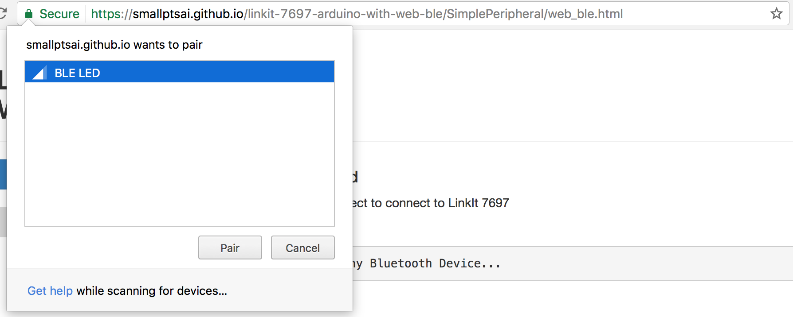
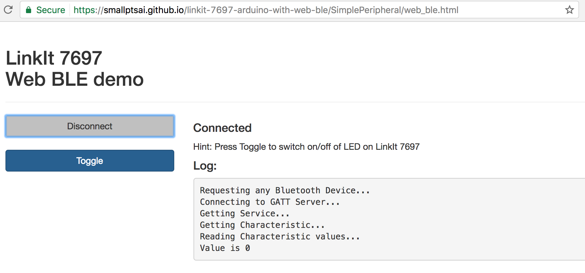

# LinkIt 7697 Arduino with Web BLE

This repo contains some LinkIt 7697 Arduino project with Web BLE interface.

With an BLE-enabled **laptop** (ex. Macbook) or an BLE-enabled **mobile phone** (ex. Android phone), you can use them to interact with LinkIt 7697 devices.

* **_LinkIt 7697_**
  * An Wi-Fi / BLE HDK, with Arduino IDE, by MediaTek. see https://docs.labs.mediatek.com/resource/linkit7697-arduino/en.
* **_Web BLE_**
  * Web bluetooth API [Link](https://developers.google.com/web/updates/2015/07/interact-with-ble-devices-on-the-web) enables browser to use Bluetooth functionality.
  * It is NOT W3C standard, therefore only partial browsers/platforms support it. Currently it is only available on:
    * **Chrome** browser - Desktop version
    * **Chrome** browser - Android 6 (Marshmallow) and above
    * Check https://www.chromestatus.com/feature/5264933985976320 for latest status.

```diff
- iOS: Web Bluetooth API is not supported yet
- Android: require Android 6 (Marshmallow) and above
```

## SimplePeripheral

This demo toggles LED of LinkIt 7697 on/off from a Web browser.

### How to Use

* Build and upload `SimplePeripheral/SimplePeripheral.ino` sketch to LinkIt 7697
* Visit https://smallptsai.github.io/linkit-7697-arduino-with-web-ble/SimplePeripheral/web_ble.html with Web Bluetooth API enabled browser 
  
* Click `Connect` button, select `BLE LED` device and pair.
  
* Click `Toggle` button to switch on/off LED on LinkIt 7697
  

